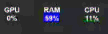

`Python` `sys` `PySide6` `psutil` `GPUtil`

## 📦 Required Libraries (for Python Scripts)
This app depends on the following Python libraries:

- [psutil](https://pypi.org/project/psutil/) - Get CPU/RAM Usage
- [GPUtil](https://pypi.org/project/GPUtil/) - Get GPU Usage
- [PySide6](https://pypi.org/project/PySide6/) - GUI & System Tray Display

## 💻 Execution Environment
- Python 3.12 (64-bit recommended)
- Windows / Linux
* macOS not tested

## 🎬Run Video

